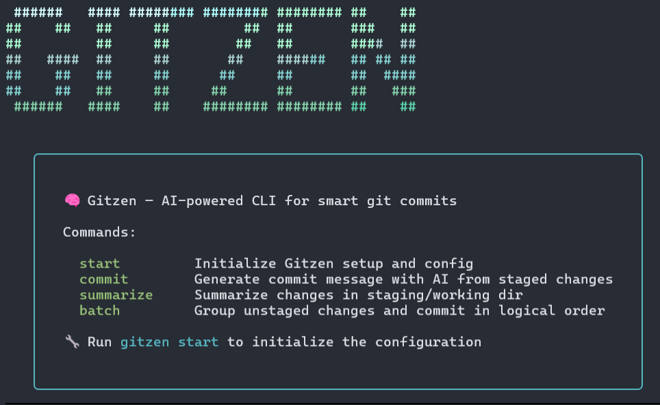

[](https://www.npmjs.com/package/gitzen)
[](https://www.npmjs.com/package/gitzen)
[](https://github.com/JorgeRosbel/gitzen/actions)
[](LICENSE)

# Gitzen: AI-powered CLI Tool for Automatic Git Commit Message Generation

**Gitzen** is a command-line tool that uses AI to automatically generate concise and well-formatted git commit messages. It integrates with popular AI providers like Google Gemini and supports customizable templates and languages.



<p align="left">
  
  
  

  
  
  
</p>

---

## 📚 Table of Contents


* [📦 Installation](#-installation)
* [🛠️ Commands](#-gitzen-command-summary)
  * [🚀 Start](./docs/start.md)
  * [💾 Commit](./docs/commit.md)
  * [🧠 Summarize](./docs/summarize.md)
  * [📂 Batch](./docs/batch.md)
  * [🔍 Review](./docs/review.md)
* [Gitzen Command Usage & Best Practices](./docs/examples.md)

---

## 📦 Installation

You can install Gitzen globally using your preferred package manager:

```bash
npm install -g gitzen
# or
pnpm add -g gitzen
# or
yarn global add gitzen
```

Once installed globally, the `gitzen` command will be available anywhere in your system.

## 🧾 Gitzen Command Summary

| Command            | Description                                            | Notes                                                              | Requires Staging |
| ------------------ | ------------------------------------------------------ | ------------------------------------------------------------------ | ---------------- |
| `gitzen start`     | 🚀 Initialize Gitzen setup and config                  | Run once to configure the CLI                                      | ❌                |
| `gitzen commit`    | 💾 Generate commit message with AI from staged changes | Requires staged files. Optional: `-y` to auto-accept, `-e` to edit | ✅                |
| `gitzen summarize` | 🧠 Summarize changes in staging/working dir            | Optional: `-l <language>`                                          | ❌                |
| `gitzen batch`     | 📂 Group unstaged changes and commit in logical order  | Optional: `-i` to ignore `gitzen.config.json`                      | ❌                |
| `gitzen review`    | 🔍 Gives you a review of the code in the staging area  | Requires staged files. Optional: `-l <language>`                   | ✅                |


Love **Gitzen**? Support the project by buying me a coffee! ☕️  
[](https://ko-fi.com/jorgerosbel)


## 📁 Project Structure

The following is the folder and file structure of the project:

```txt
gitzen/
├── __tests__/
│   ├── commitFlow.test.ts
│   └── summarizerFlow.test.ts
│
├── .github/
│   └── workflows/
│       ├── lint_format.yaml
│       ├── publish.yaml
│       └── test.yaml
│
├── .husky/
├── dist/
├── docs/
├── node_modules/
│
├── src/
│   ├── commands/
│   ├── providers/
│   ├── templates/
│   ├── utils/
│   └── index.ts
│
├── types.d.ts
├── .gitignore
├── .npmignore
├── .npmrc
├── .prettierignore
├── .eslintrc.json
├── gitzen.config.json
├── LICENSE
├── package.json
├── package-lock.json
├── prettier.config.mjs
├── README.md
├── tsconfig.json
├── tsup.config.ts
└── vitest.config.ts
```
