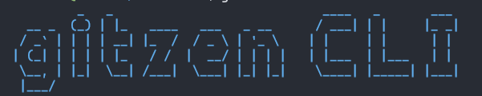
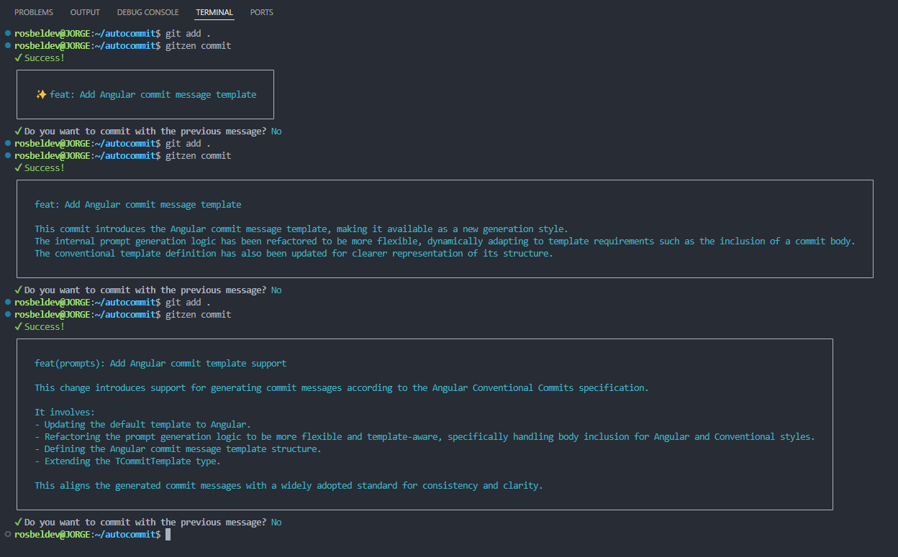

# Gitzen: AI-powered CLI Tool for Automatic Git Commit Message Generation

**Gitzen** is a command-line tool that uses AI to automatically generate concise and well-formatted git commit messages. It integrates with popular AI providers like Google Gemini and supports customizable templates and languages.



---

## 📚 Table of Contents

* [Installation](#-installation)
* [API Key Configuration](#-api-key-configuration)
* [Commands](#-commands)

  * [`gitzen start`](#gitzen-start)
  * [`gitzen.config.json` Options](#-gitzenconfigjson-options)
  * [`gitzen commit`](#gitzen-commit)
* [Example Workflow](#️-example-workflow)
* [Tips](#-tips)
* [Coming Soon](#-coming-soon)

---

## 📦 Installation

You can install Gitzen globally using your preferred package manager:

```bash
npm install -g gitzen
# or
pnpm add -g gitzen
# or
yarn global add gitzen
```

Once installed globally, the `gitzen` command will be available anywhere in your system.

### 🔐 API Key Configuration

During the initial setup, Gitzen will prompt you to provide an API key for your chosen AI provider (e.g., Google Gemini). This key must be stored as an environment variable using the following name:

```bash
GITZEN_API_KEY
```

You can:

* Follow the interactive prompt during `gitzen start` to set it up, or
* Add it manually to your shell configuration:

```bash
export GITZEN_API_KEY="your-api-key-here"
```

If you prefer, you can skip this step during setup and provide the key later.

To manually create or update your API key for a specific model or service, follow these steps:

1. Open your terminal and run the following command to edit your shell configuration file:

```bash
nano ~/.bashrc
```

2. Add your API key to the file by inserting this line (replace `secret_key` with your actual API key):

```bash
export GITZEN_API_KEY="secret_key"
```

3. Save and exit the editor (in nano, press `CTRL+O` to save and `CTRL+X` to exit).

4. Apply the changes to your current terminal session by running:

```bash
source ~/.bashrc
```

This is the proper way to manually configure or update your API key in a Linux terminal environment. The key will now be available as an environment variable and can be accessed by your applications.

---

## 🚀 Commands

### `gitzen start`

Initializes the configuration for Gitzen. This command will guide you step-by-step to set up your preferred settings.

It creates a configuration file in your project root called `gitzen.config.json`:

```json
{
  "language": "en",
  "template": "commitlint",
  "model": "gemini-2.5-flash",
  "size": "36–50 characters",
  "provider": "google"
}
```

You can customize the following options manually in the config file:

### 📝 `gitzen.config.json` Options

#### `language` (type: `TLang`)

Sets the language for your commit messages.

```ts
'en' | 'es' | 'pt' | 'fr' | 'de' | 'it' | 'zh' | 'ja' | 'ko'
```

#### `template` (type: `TCommitTemplate`)

Defines the format of your commit messages.

```ts
'commitlint' | 'conventional' | 'angular'
```

#### `model` (type: `TModel`)

Specifies the AI model to use for generation.

```ts
'gpt-4.1'
'gpt-4o-2024-08-06'
'gpt-4o-mini'
'gpt-4'
'gpt-3.5-turbo'
'gemini-2.5-flash'
'gemini-2.0-flash'
```

You can also use any custom model string.

#### `size` (type: `TSize`)

Preferred length of the generated commit message.

```ts
'16–35 characters'
'36–50 characters'
'51–80 characters'
'81–120 characters'
```

#### `provider` (type: `TProviders`)

Chooses the AI service provider.

```ts
'google' | 'openai' | 'anthropics'
```

---

### `gitzen commit`

Generates a commit message using the configured AI model and creates the git commit automatically.

Gitzen analyzes your staged changes and generates a concise message based on your settings.

---

## 🛠️ Example Workflow

```bash
gitzen start        # Set up your preferences
git add .           # Stage your changes
gitzen commit       # Generate and commit with AI
```

### The generated commit messages are shown using different templates

Please note that you have full control to review and choose whether to accept and execute the generated commit message



---

## 💡 Tips

* You can use Gitzen in any project with git initialized.
* Ideal for teams seeking consistency and clarity in commits.
* Avoids vague or uninformative commit messages.

---

## 📣 Coming Soon

* Support for custom templates
* Multiple model providers

---

Gitzen simplifies and elevates your Git workflow with the power of AI. 🚀
