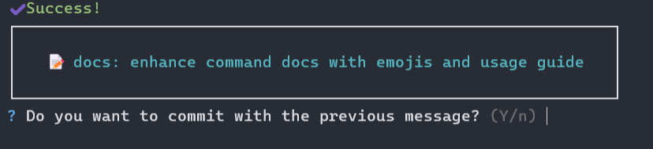
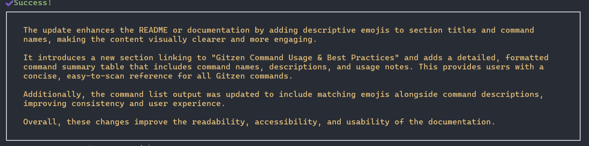
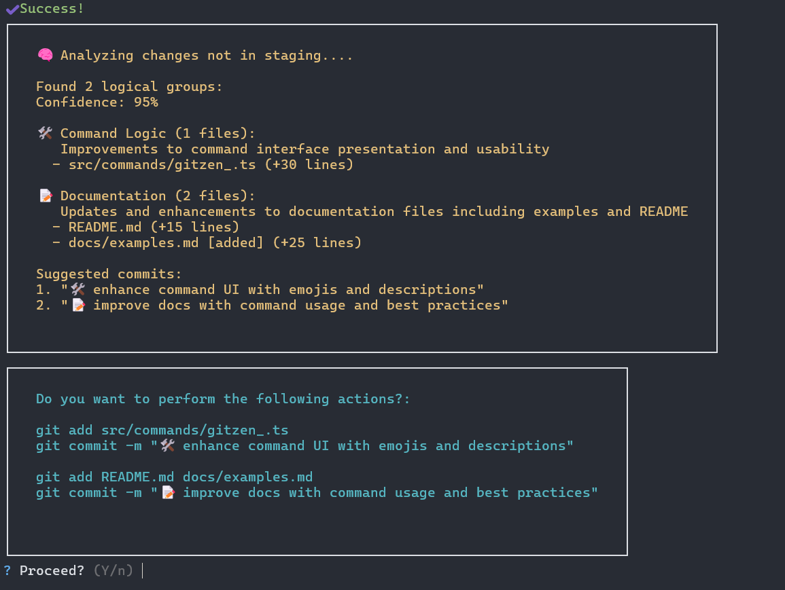
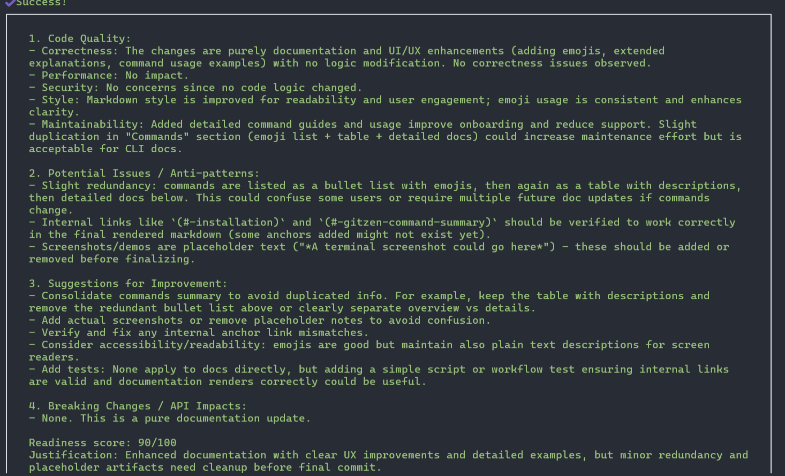

# 💡 Gitzen Command Usage & Best Practices

## 📚 Table of Contents

* [🚀 `gitzen start`](#-gitzen-start)
* [💾 `gitzen commit`](#-gitzen-commit)
* [🧠 `gitzen summarize`](#-gitzen-summarize)
* [📂 `gitzen batch`](#-gitzen-batch)
* [🔍 `gitzen review`](#-gitzen-review)

This guide explains how and when to use Gitzen commands effectively in your development workflow.

---

## 🚀 `gitzen start`

Use this command the first time you install Gitzen globally, or whenever you switch to a new project directory. It creates a `gitzen.config.json` file, initializing your Gitzen environment.

### Example Workflow:

```sh
gitzen start
```

*A terminal screenshot could go here to show what Gitzen initializes.*

---

## 💾 `gitzen commit`

This command analyzes your **staged changes** and suggests an AI-generated commit message. Use it when the code changes are logically related. You can accept or edit the suggestion.

### Example Workflow:

```sh
git add .
gitzen commit
```

*A screenshot would show the suggestion and approval process.*



After accepting the commit:

```sh
git push
```

---

## 🧠 `gitzen summarize`

Use this command to get a summary of all changes in both the staging area and working directory. You can request the summary in your default language or specify another with `-l`.

### Example Workflow:

```sh
gitzen summarize

# In another language:
gitzen summarize -l es
```

*A screenshot would help visualize the summary output.*



---

## 📂 `gitzen batch`

This is Gitzen’s most powerful command. It works with **unstaged changes**, so be cautious. Use it when you've made many unrelated changes across your project — Gitzen will group them and suggest commits in a logical order.

### Example Workflow:

```sh
gitzen batch
```

It will:

* Analyze unstaged changes
* Suggest grouped commits with messages
* Ask for your confirmation

Upon approval, Gitzen stages and commits the files for you.
*A screenshot would illustrate the grouping process.*



---

## 🔍 `gitzen review`

Gitzen reviews your **staged code** and provides a readiness score (0–100) based on AI analysis. Optionally, you can request the review in another language with `-l`.

### Example Workflow:

```sh
git add .
gitzen review

# In another language:
gitzen review -l es
```

*An image could show the score and feedback given by the AI.*

